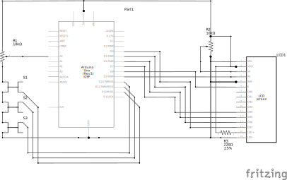

# ArduinoMusicCtl

A music controlling gadget built with arduino

## How it works

The python program recieves instructions from the arduino via serial and calls a commandline program to perform the action.
It also checks the title and artist of the currently playing song and sends them to the arduino.

It uses playerctl to support all media players that implement the MPRIS D-Bus Interface Specification.

## Hardware Setup

## Requirements

[playerctl](https://github.com/altdesktop/playerctl) is used to control the media player. You can edit the main.py to use a different program.

The [LiquidCrystal](https://github.com/arduino-libraries/LiquidCrystal) and [Button](https://github.com/madleech/Button) libraries for arduino are also required.
